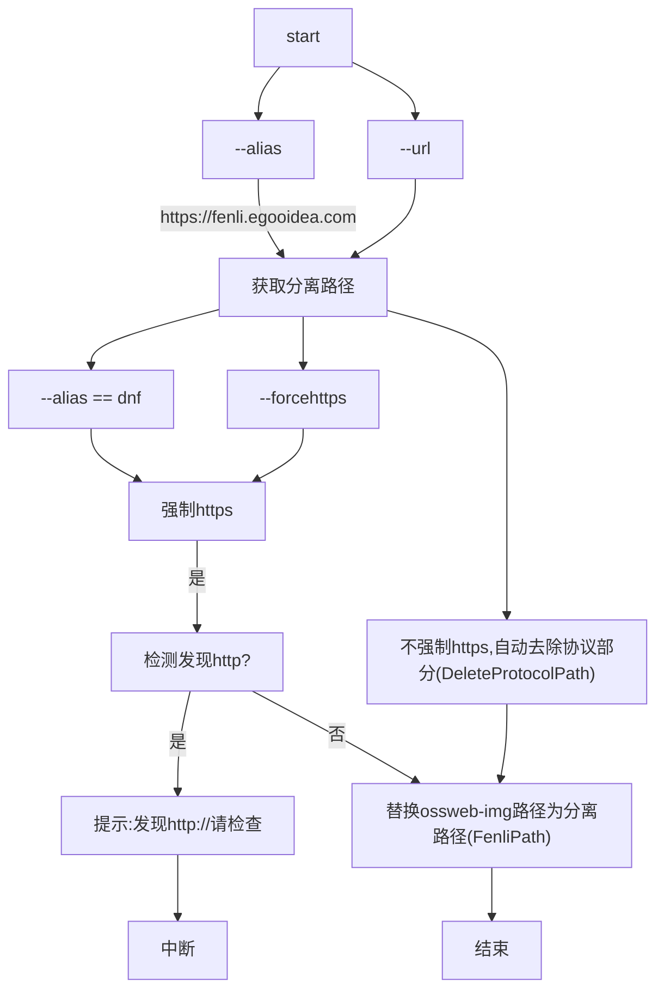

fenli流程图

```mermaid
graph TD
  A[start] --> A1[--alias]
  A --> A2[--url]
  A1 --> |https://fenli.egooidea.com| B[获取分离路径]
  A2 --> B
  B --> C[--alias == dnf]
  B --> D[--forcehttps]
  C --> E[强制https]
  D --> E
  E --> |是| F[检测发现http?]
  F --> |是| G[提示:发现http://请检查]
  G --> X[中断]
  F --> |否| P
  B --> O["不强制https,自动去除协议部分(DeleteProtocolPath)"]
  O --> P["替换ossweb-img路径为分离路径(FenliPath)"]
  P --> Z[结束]
```