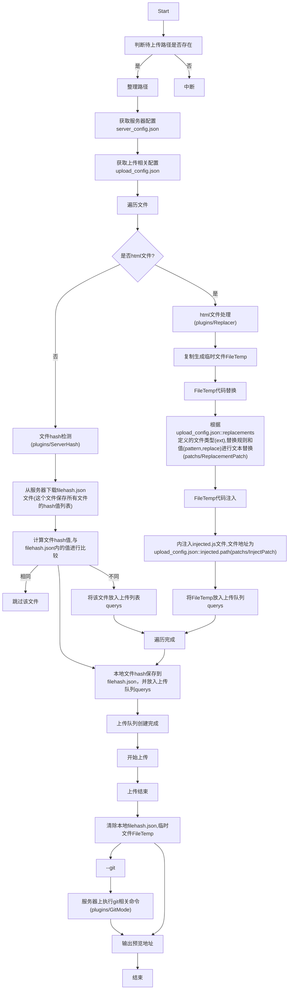

upload流程图

```mermaid
graph TD
    A[Start] --> A1[判断待上传路径是否存在]
    A1 --> |是| B[整理路径];
    A1 --> |否| X[中断]
    B --> B1[获取服务器配置server_config.json]
    B1 --> B2[获取上传相关配置upload_config.json]
    B2 --> C[遍历文件]
    C --> C1{是否html文件?}
    C1 --> |否| D["文件hash检测(plugins/ServerHash)"]
    D --> D1["从服务器下载filehash.json文件(这个文件保存所有文件的hash值列表)"]
    D1 --> D2[计算文件hash值,与filehash.json内的值进行比较]
    D2 --> |相同| D3[跳过该文件]
    D2 --> |不同| D4[将该文件放入上传列表querys]
    D4 --> G3
    D2 ----> D5["本地文件hash保存到filehash.json，并放入上传队列querys"]
    
    C1 --> |是| E["html文件处理(plugins/Replacer)"]
    E --> E1[复制生成临时文件FileTemp]
    E1 --> F[FileTemp代码替换]
    F --> F1["根据upload_config.json::replacements定义的文件类型(ext),替换规则和值(pattern,replace)进行文本替换(patchs/ReplacementPatch)"]
    F1 --> G[FileTemp代码注入]
    G --> G1["<head>内注入injected.js文件,文件地址为upload_config.json::injected.path(patchs/InjectPatch)"]
    G1 --> G2[将FileTemp放入上传队列querys]
    G2 --> G3[遍历完成]
    G3 --> D5 --> H[上传队列创建完成]
    H --> H2[开始上传]
    H2 --> H3[上传结束]
    H3 --> H4[清除本地filehash.json,临时文件FileTemp]
    H4 --> I[--git]
    I --> I1["服务器上执行git相关命令(plugins/GitMode)"]
    I1 --> J[输出预览地址]
    H4 --> J
    J --> Z[结束]
```