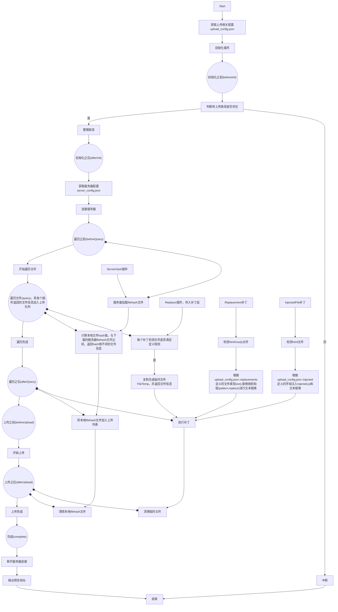

uploader主流程图

```mermaid
graph TD
    A[Start] --> A0[获取上传相关配置upload_config.json]
    A0 --> A01[初始化插件]
    A01 --> FLOW1(("初始化之前(beforeInit)"))
    FLOW1 --> A1[判断待上传路径是否存在]
    A1 --> |是| A2[整理路径]
    A1 --> |否| X[中断] --> G2
    A2 --> FLOW2(("初始化之后(afterInit)"))
    FLOW2 --> B1[获取服务器配置server_config.json]
    B1 --> B2[连接服务器]
    B2 --> FLOW3(("遍历之前(beforeQuery)"))
    FLOW3 --> C[开始遍历文件]
    C --> FLOW4(("遍历文件(query)，将各个插件返回的文件信息加入上传队列"))
    FLOW4 --> D[遍历完成]
    D --> FLOW5(("遍历之后(afterQuery)"))
    FLOW5 --> FLOW6(("上传之前(beforeUpload)"))
    FLOW6 --> E[开始上传]
    E --> FLOW7(("上传之后(afterUpload)"))
    FLOW7 --> F[上传完成]
    F --> FLOW8(("完成(complete)"))
    FLOW8 --> G[断开服务器连接]
    G --> G1[输出预览地址]
    G1 --> G2[结束]

    PLGA[ServerHash插件] --> PLGA1[服务器加载filehash文件]
    FLOW3 o--o PLGA1
    PLGA1 --> PLGA2["计算本地文件hash值，与下载的服务器filehash文件比较，返回hash值不同的文件信息"]
    FLOW4 o--o PLGA2
    PLGA2 --> PLGA3[将本地filehash文件加入上传列表]
    FLOW5 o--o PLGA3
    PLGA3 --> PLGA4[清除本地filehash文件]
    FLOW7 o--o PLGA4
    

    PLGB["Replacer插件，传入补丁组"] --> PLGB1["每个补丁检测文件是否满足定义规则"]
    PLGB1 --> |是|PLGB2["复制生成临时文件FileTemp，并返回文件信息"]
    FLOW4 o--o PLGB1
    PLGB2 --> PLGB3[执行补丁]
    FLOW5 o--o PLGB3
    PLGB3 --> PLGB4[清理临时文件]
    FLOW7 o--o PLGB4

    PTHA[Replacement补丁] --> PTHA1["检测html/css/js文件"]
    PTHA1 --> PTHA2["根据upload_config.json::replacements定义的文件类型(ext),替换规则和值(pattern,replace)进行文本替换"]
    PTHA2 --> PLGB3

    PTHB[InjectedFile补丁] --> PTHB1["检测html文件"]
    PTHB1 --> PTHB2["根据upload_config.json::injected定义的字段注入injected.js和文本替换"]
    PTHB2 --> PLGB3
```